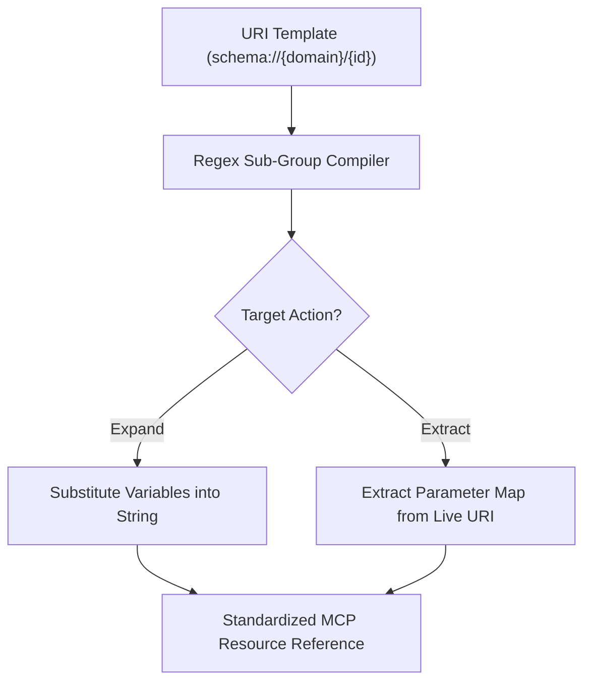

# genpark-mcp-resource-uri-template-resolver-skill

Agent Skill implementing **RFC 6570 MCP Resource URI Template Resolution** in 100% Python standard library.

## Architectural Flow

```mermaid
flowchart TD
    Template["URI Template (schema://{domain}/{id})"] --> Parser["Regex Sub-Group Compiler"]
    Parser --> Match{"Target Action?"}
    Match -->|Expand| Sub["Substitute Variables into String"]
    Match -->|Extract| Group["Extract Parameter Map from Live URI"]
    Sub & Group --> Result["Standardized MCP Resource Reference"]
```
